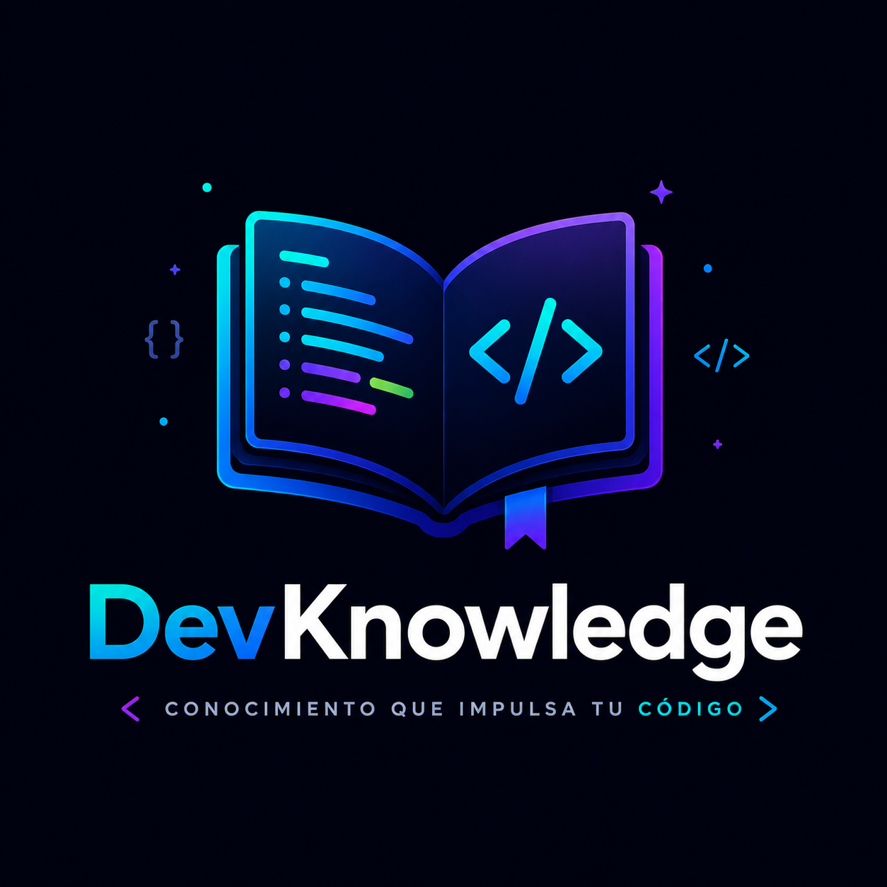

<div align="center">
  

  <h1>DevKnowledge API</h1>

  <p>
    <strong>Open-source REST API for structured programming knowledge.</strong><br/>
    Built to be consumed by educational platforms, developer tools, bots, and any application that needs reliable programming content.
  </p>

  <p>
    
    
    
    
    
  </p>

  <p>
    <a href="#descripción">Descripción</a> ·
    <a href="#api-resources">API Resources</a> ·
    <a href="#getting-started">Getting Started</a> ·
    <a href="#arquitectura">Arquitectura</a> ·
    <a href="#documentación-de-endpoints">Endpoints</a> ·
    <a href="#contribución">Contribución</a>
  </p>
</div>

---

## Descripción

**DevKnowledge** es una API REST de código abierto diseñada para centralizar y distribuir conocimiento estructurado sobre programación de manera estandarizada, accesible y reutilizable.

A diferencia de un sitio de documentación tradicional, DevKnowledge no está pensada para que el usuario final navegue artículos — está diseñada para que **las aplicaciones consuman información mediante HTTP** y reciban respuestas JSON listas para integrarse en cualquier proyecto.

### Problema que resuelve

Existen numerosas APIs públicas para acceder a información sobre clima, películas o geografía, pero no existe una API abierta y estructurada que proporcione **conocimiento de programación** listo para consumir. La mayoría de plataformas educativas almacenan su contenido de manera privada, haciendo imposible reutilizarlo.

DevKnowledge resuelve esto proporcionando una base de conocimiento abierta, organizada y mantenida por la comunidad.

---

## API Resources

La API expone contenido estructurado sobre múltiples tecnologías y lenguajes.

### Categorías de contenido

| Categoría | Descripción |
|---|---|
| Lenguajes de programación | Python, JavaScript, Rust, Go, PHP, etc. |
| Frameworks y librerías | Laravel, React, Vue, Django, etc. |
| Bases de datos | SQL, PostgreSQL, MongoDB, Redis, etc. |
| Herramientas de desarrollo | Docker, Git, CI/CD, etc. |
| Conceptos de informática | Algoritmos, estructuras de datos, etc. |
| Arquitectura de software | REST, microservicios, DDD, etc. |
| Buenas prácticas | SOLID, Clean Code, etc. |
| Patrones de diseño | Factory, Observer, Repository, etc. |

---

## Getting Started

Sigue estos pasos para levantar el proyecto localmente.

### Pre-requisitos

- [Docker](https://www.docker.com/) y Docker Compose instalados.
- PHP 8.3+ y Composer (para instalación local).
- Una base de datos PostgreSQL 17 en [Neon](https://neon.tech) (o local).

### Instalación

1. Clona el repositorio:
```bash
git clone https://github.com/tu-usuario/DevKnowledge-API.git
cd DevKnowledge-API
```

2. Copia el archivo de entorno y configura las variables (especialmente la conexión a base de datos y Redis):
```bash
cp .env.example .env
```

3. Instala las dependencias con Composer:
```bash
composer install
```

4. Genera la key de la aplicación y corre las migraciones (si usas base de datos local):
```bash
php artisan key:generate
php artisan migrate --seed
```

5. Levanta el servidor localmente:
```bash
php artisan serve
# o usando Octane si está configurado localmente
php artisan octane:start
```

---

## Arquitectura

```text
Aplicación cliente
        │
        ▼
   Nginx (puerto 8080)
        │  proxy_pass
        ▼
Laravel Octane (RoadRunner, puerto 8000)
        │
        ├──────────────────┐
        ▼                  ▼
PostgreSQL (Neon)       Redis Cache
```

---

## Uso de la API

La API está en producción y lista para ser consumida de manera pública. Actualmente, las rutas de lectura (`GET`) son públicas.

**Base URL:** `https://devknowledge-api.onrender.com/api`

### Ejemplo de Petición

Obtener todos los temas disponibles (Topics):
```bash
curl -X GET https://devknowledge-api.onrender.com/api/topics
```

## Documentación de Endpoints

La documentación interactiva completa (Swagger/OpenAPI) para explorar todas las rutas disponibles la encuentras en:

```
https://devknowledge-api.onrender.com/api/documentation
```

---

## Casos de Uso

La API está diseñada para ser consumida por:

- Plataformas educativas y LMS
- Aplicaciones móviles de aprendizaje
- Juegos educativos (como **DEVLO**)
- Extensiones para VS Code
- Bots de Discord y Telegram
- Sitios web de documentación
- Proyectos universitarios

---

## Contribución

¡Las contribuciones son bienvenidas! Si deseas agregar nuevo contenido, mejorar los endpoints o corregir bugs:
1. Haz un Fork del repositorio.
2. Crea una rama para tu feature (`git checkout -b feature/NuevaCaracteristica`).
3. Haz commit de tus cambios (`git commit -m 'feat: agrega nueva característica'`).
4. Haz push a la rama (`git push origin feature/NuevaCaracteristica`).
5. Abre un Pull Request.

---

## Licencia

Este proyecto está bajo la Licencia MIT.
